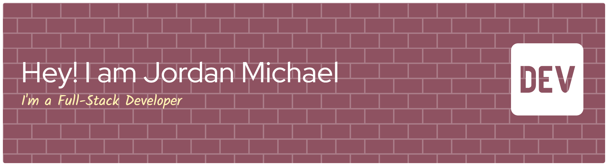

  

## 💡 About Me

* 🎓 Mahasiswa aktif di **Fasilkom-TI USU**
* 🌱 Sedang belajar **Pengembangan Web, Basis Data, dan Algoritma**
* ✨ Tertarik pada UI/UX, Backend Development, dan Pengolahan Data
* 🎯 Tujuan Saya Menjadi Software Engineer

## 🛠️ Tech Stack
### 💻 Languages

### 🌐 Web & Frameworks

### 🔧 Tools & Security

## 📊 GitHub Stats

  
  

## Game PacMan

## 🕹️ Game PacMan

###

## 📱 Socials

